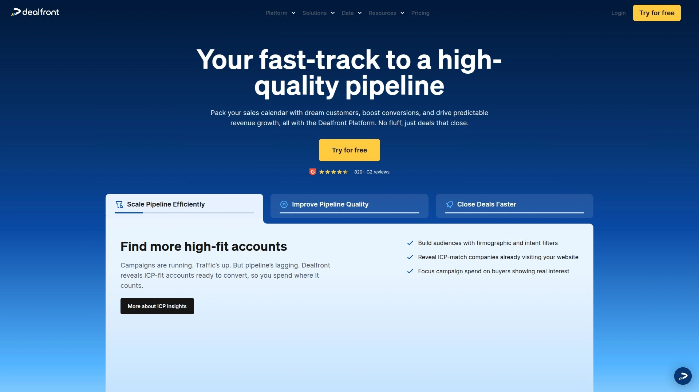
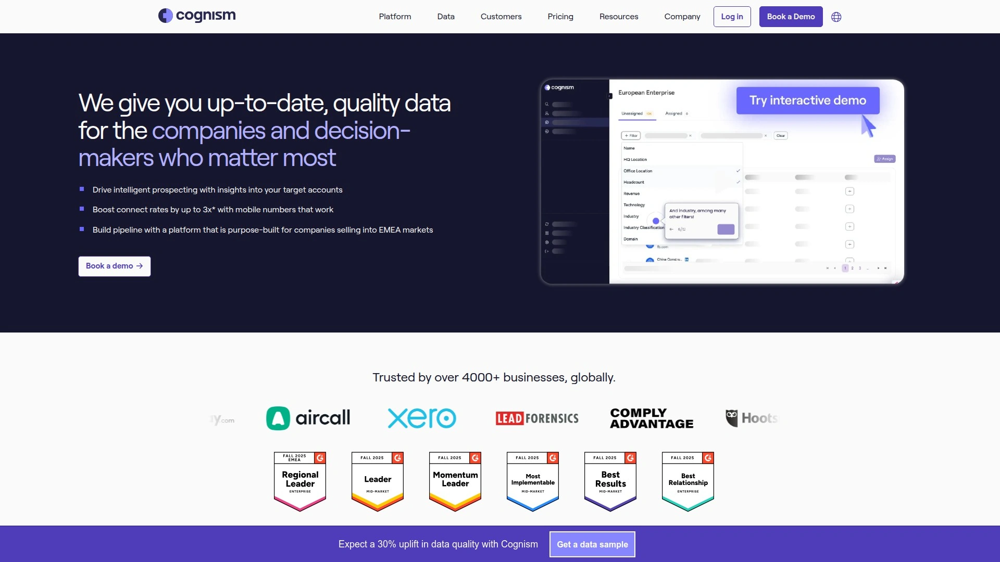
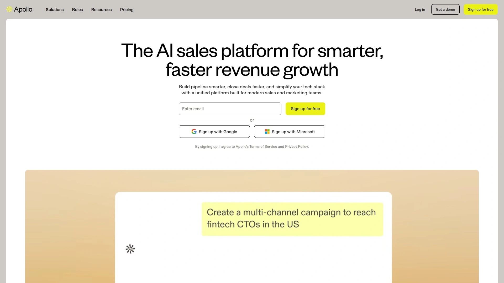
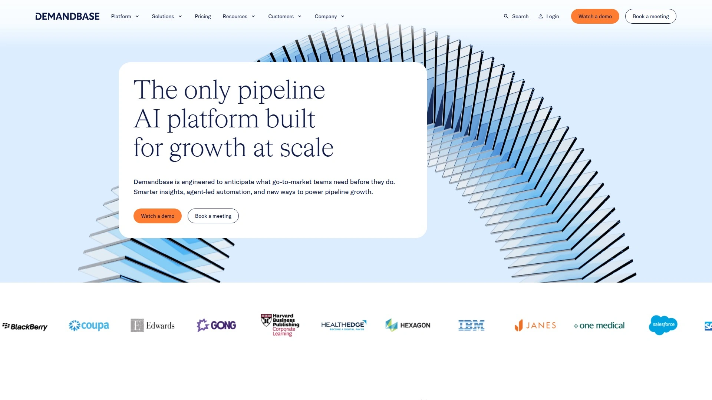
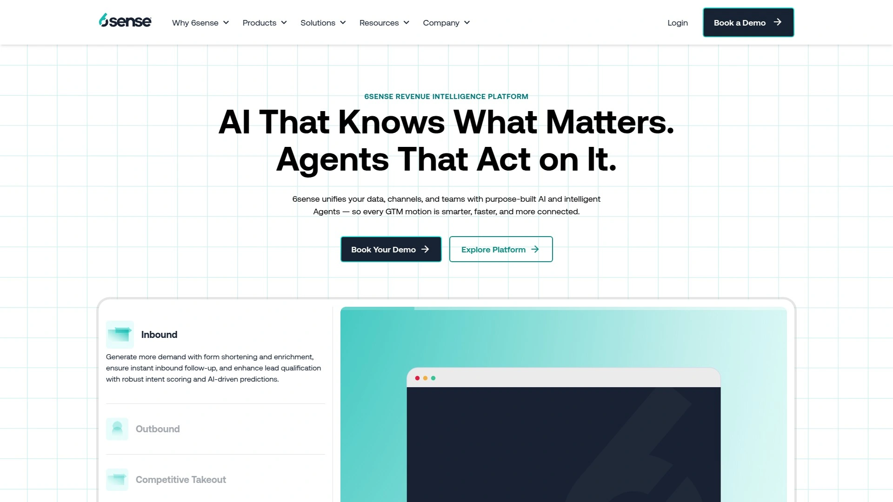
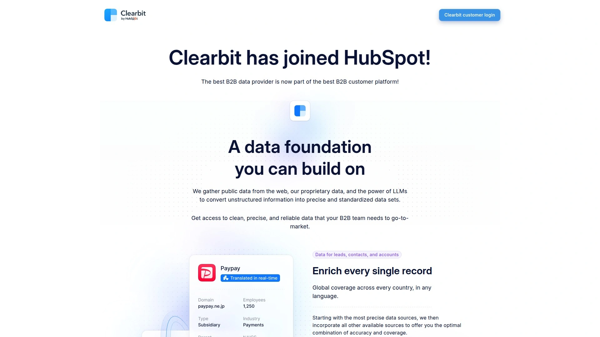
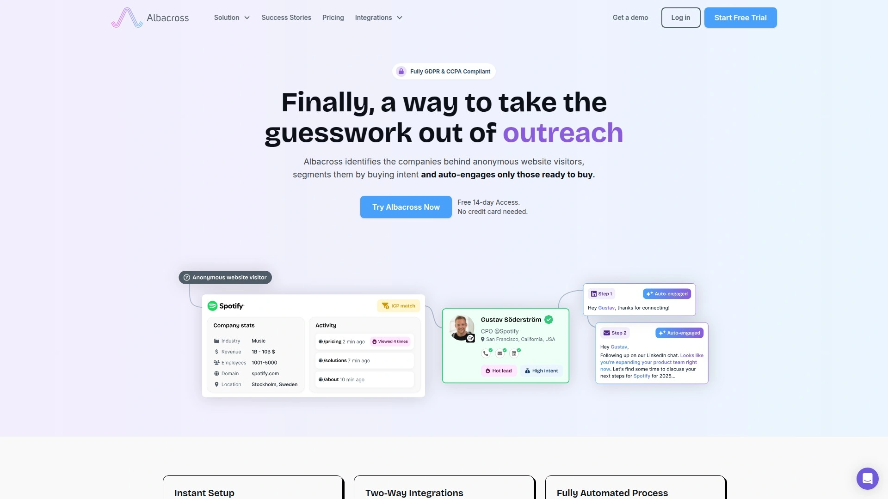
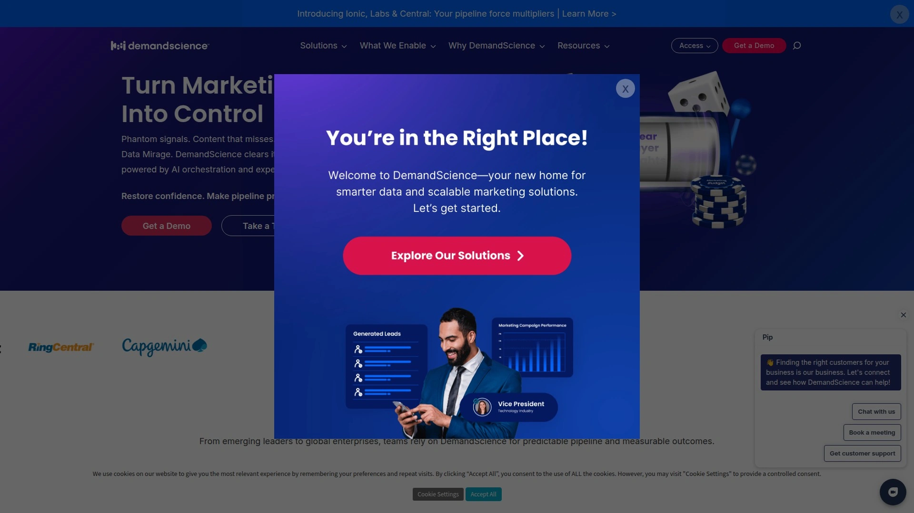
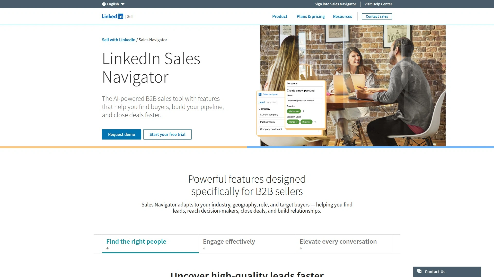
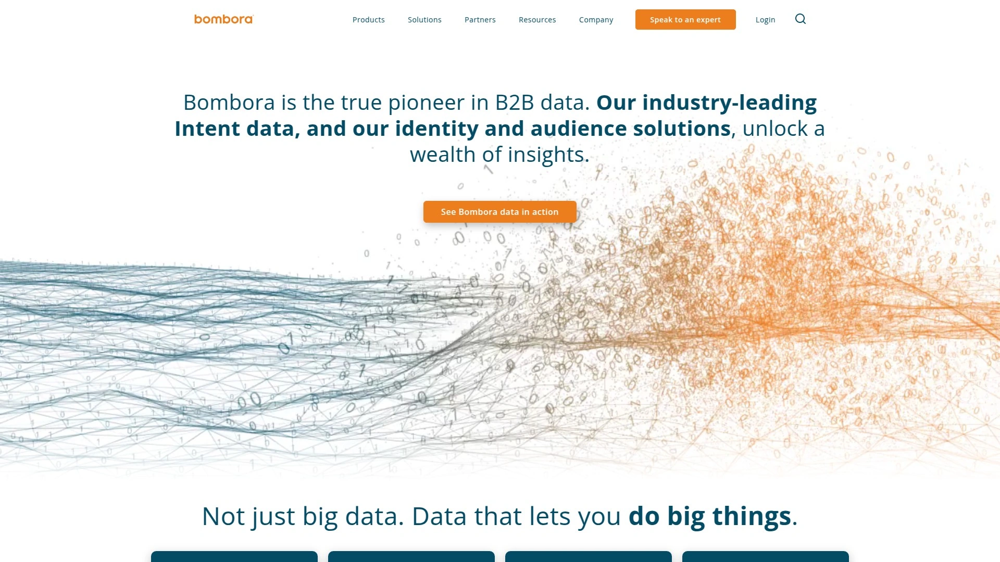

# Top 12 B2B Sales Intelligence Platforms Ranked in 2025 (Latest Compilation)

Running a B2B company means dealing with anonymous website traffic, outdated contact lists, and missed opportunities because you can't identify who's actually interested in what you're selling. Sales intelligence platforms solve this by revealing which companies are visiting your site, providing verified contact data, and showing real-time buying signals so your team can focus on accounts ready to convert rather than chasing cold leads.

---

## **[Dealfront](https://www.dealfront.com/)**

Your fast-track platform for building high-quality pipeline with real-time account identification and buyer intent signals.

Dealfront combines website visitor tracking, contact database access, and intent monitoring into one seamless engine for sales and marketing teams. The platform identifies companies visiting your website, reveals buying signals across 40+ data points, and helps prioritize accounts showing genuine interest. With access to 60 million companies and 400 million verified contacts, plus advanced filtering through 100+ criteria, teams can build targeted prospect lists quickly. The system automatically alerts sales via Slack or email when high-fit accounts engage with key content, enabling timely outreach. Integration with major CRMs means qualified leads flow directly into existing workflows without manual data entry.

Dealfront stands out for its ability to track both on-site and off-site buying behavior, giving a complete picture of account interest levels. The platform helps reduce prospecting time by up to 75% while increasing conversion rates from marketing qualified leads to sales qualified leads by as much as 75%. Teams using Dealfront report identifying up to three times more ideal customer profile accounts compared to traditional methods.

***

## **[Cognism](https://www.cognism.com/)**

Premium global sales intelligence with phone-verified contact data and intent signals for high-quality prospecting.

Cognism delivers globally compliant B2B data with exceptional coverage across Europe and North America, offering phone-verified mobile numbers and diamond-verified emails that connect sales teams to decision-makers. The platform combines firmographic data, technographic insights, and Bombora-powered intent signals to surface accounts actively researching solutions. Sales Companion, their Chrome extension, works across LinkedIn and company websites to find contacts anywhere you prospect. With seamless integrations into Salesforce, HubSpot, and other CRMs, contact data flows directly into existing tech stacks.

The platform particularly excels at senior-level contact discovery, helping revenue teams connect with C-suite executives and key decision-makers. Cognism's commitment to data quality means their contacts connect successfully in 9 out of 10 attempts, significantly higher than industry averages. The AI-driven intent data helps teams understand which accounts are in-market, allowing for perfectly timed outreach that increases engagement rates.

***

## **[ZoomInfo](https://www.zoominfo.com/)**

Comprehensive B2B database with advanced filtering capabilities and deep company intelligence for enterprise sales teams.

ZoomInfo provides one of the largest B2B contact and account databases available, featuring extensive search and filtering capabilities that help teams generate leads quickly. The platform offers website visitor tracking, buyer intent data, and digital advertising tools to maximize sales and marketing automation. Integration with major CRM platforms enables smooth data flow between systems. ZoomInfo's strength lies in its breadth of coverage across industries and company sizes, making it suitable for teams targeting diverse markets.

While powerful, ZoomInfo requires higher investment to unlock advanced features and international data access through their Data Passport offering. The platform works best for mid-market to enterprise organizations with substantial prospecting needs and budget to match. Community-verified mobile numbers mean data accuracy depends on ongoing user contributions rather than in-house verification.

***

## **[Apollo.io](https://www.apollo.io/)**

All-in-one sales platform combining a massive contact database with email automation and engagement sequencing.

Apollo.io packages multiple sales tools into a unified platform, offering access to 275 million contacts and 73 million accounts with 65+ advanced filters for precise targeting. The system includes robust email automation, multi-channel sequencing, lead scoring powered by AI, and website visitor tracking capabilities. Intent signal integration through Bombora helps identify prospects showing buying behavior, while the Chrome extension provides instant access to contact data across LinkedIn, HubSpot, Salesforce, and company websites. Apollo's freemium model makes it accessible for teams of all sizes.

The platform shines in consolidating capabilities that typically require multiple tools, potentially replacing both prospecting databases and engagement platforms. Users can build targeted lists, launch outreach campaigns with automated and manual touchpoints, and track performance all within one interface. However, the learning curve can be steep for new users, and data accuracy requires regular updates to maintain quality.

***

## **[Demandbase](https://www.demandbase.com/)**

AI-powered account-based marketing platform with account intelligence built from over one trillion signals monthly.

Demandbase specializes in account-based strategies, merging first-party data with trusted third-party intelligence to help B2B teams identify, prioritize, and engage high-value accounts. The platform processes over one trillion signals monthly, drawing from 40,000+ sources to provide insights on 99 million companies and 150 million contacts. Account Intelligence combines firmographic, technographic, and behavioral data to score and rank target accounts, while predictive analytics help forecast pipeline opportunities. The platform includes a B2B-specific demand-side platform for targeted advertising, site analytics to track account engagement, and orchestration tools to align marketing and sales efforts.

Demandbase excels at revealing which accounts are actively researching solutions, even before they visit your website. The platform tracks buying behaviors across the anonymous B2B web, providing X-ray vision into prospect interests and concerns. Integration capabilities ensure account data flows seamlessly across CRM, marketing automation, and sales enablement tools, creating a single source of truth for revenue teams.

***

## **[6sense](https://6sense.com/)**

Predictive intelligence platform using AI to identify in-market accounts across the anonymous B2B web.

6sense employs patented AI technology and its extensive intent data network to spot companies actively researching solutions, even when they haven't visited your website yet. The platform reveals which accounts are interested, what topics they care about, how many buying team members are engaged, and how close they are to making purchase decisions. Account identification works regardless of whether prospects are researching from office or home, providing accurate matching through multiple data sources. The system creates dynamic segments based on account size, industry, technology stack, topics researched, and buying stage for highly targeted campaigns.

6sense delivers the highest account match rate in the industry, translating to more available opportunities for sales teams. The platform allows teams to acquire contact information for likely buying team members within identified hot accounts, enabling persona-based targeting. Integration with leading CRMs, marketing automation platforms, and advertising systems means teams can execute coordinated strategies across channels.

---

## **[Clearbit](https://clearbit.com/)**

Real-time data enrichment and website visitor identification now integrated within the HubSpot ecosystem.

Clearbit Reveal identifies anonymous website visitors by matching IP addresses with company profile information, showing which businesses visit even when individuals don't fill out forms. The platform enriches CRM data automatically, maintaining accurate contact and company records without manual updates. Weekly Visitor Reports deliver insights on top companies by visit frequency, traffic sources, and firmographic breakdowns including industry, employee range, and technology usage. Integration with Google Analytics allows pulling company data directly into analytics dashboards for deeper insights.

Since joining HubSpot, Clearbit's capabilities now flow through HubSpot's ecosystem, making it particularly valuable for teams already using HubSpot CRM and marketing automation. The visitor identification technology helps create targeted account-based experiences and identify intent from anonymous traffic, enabling proactive outreach to high-value prospects before they formally engage.

***

## **[Albacross](https://www.albacross.com/)**

European-focused B2B visitor intelligence with the largest proprietary IP-to-company mapping database.

Albacross specializes in identifying anonymous website visitors and decision-makers, particularly excelling in the EU market where it claims identification rates 1.7 times higher than most intent data platforms. The platform collects both on-site and off-site visitor data, segments visitors by buying intent using 100+ signals, and automates personalized email and LinkedIn sequences. Integration with Bombora enriches the offering with third-party intent data, providing comprehensive buyer intelligence. Trusted by over 10,000 companies, Albacross focuses specifically on B2B pipeline generation through first-party intent signals.

The platform's proprietary IP-to-company mapping database, built through extensive user contributions, ensures strong data quality and coverage throughout Europe. Automated workflows eliminate manual prospecting work, allowing teams to engage high-intent accounts immediately. Self-service plans start at €79 monthly for up to 100 identified companies, making it accessible for smaller teams testing visitor identification strategies.

***

## **[Terminus](https://terminus.com/)**

True ABM platform for multi-channel account engagement with best-in-class B2B advertising capabilities.

Terminus powers account-based marketing at scale across the entire customer lifecycle, including acquisition, renewal, expansion, and upsell. The platform features a Data Studio for creating segments, Engagement Hub for orchestrating multi-channel campaigns, and Measurement Studio for tracking program performance. Engagement channels include advertising experiences with higher return on ad spend and lower cost per thousand impressions, chat experiences with intelligent routing, website personalization, and email experiences with one-to-one customization. First-party data capabilities help teams leverage information already at their fingertips rather than relying solely on third-party cookies.

Terminus customers report impressive results including 684% increases in pipeline, 200% improvements in sales outreach efficiency, and 80% higher close rates. The platform's true ABM approach means marketing and sales stay aligned throughout the customer journey, focusing resources on accounts most likely to generate revenue. Integration with marketing automation platforms, CRMs, and sales tools creates connected experiences that increase intent and engagement.

***

## **[LinkedIn Sales Navigator](https://business.linkedin.com/sales-solutions/sales-navigator)**

Native LinkedIn prospecting tool with 50+ search filters accessing the platform's billion-plus professional network.

Sales Navigator provides advanced search capabilities within LinkedIn's massive professional network, offering filters for function, seniority level, years at company, experience, and dozens more criteria. The platform delivers real-time alerts when saved leads experience job changes, post updates, or appear in news, enabling perfectly timed outreach. Lead Builder helps create highly targeted prospect lists using criteria unavailable in free LinkedIn accounts, while the ability to save searches and receive alerts ensures consistent pipeline feeding. Direct CRM integration allows adding leads instantly with automatic duplicate checking and data validation.

The tool excels at relationship-driven selling, helping teams identify decision-makers, track account changes, and maintain warm connections through engagement with prospect content. Sales Navigator adapts to specific industries, geographies, roles, and target buyers, making it versatile across different B2B contexts. Advanced Plus plans offer enhanced features including instant CRM syncing and comprehensive lead management capabilities.

***

## **[Bombora](https://bombora.com/)**

Consent-based intent data provider tracking buyer research across 5,000+ B2B websites.

Bombora pioneered B2B intent data collection through a cooperative model where data comes from consent rather than scraping, ensuring premium quality and compliance. The platform tracks digital journeys across a vast network of B2B publications, review sites, and business resources, capturing buying signals from 5,000+ sources. With 12,000+ intent topics and 70% exclusive data not available elsewhere, Bombora provides unique insights into which companies are researching specific solutions. The system considers historical baseline consumption patterns, flagging only significant spikes in interest as genuine intent signals.

Many leading sales intelligence platforms including Cognism, Apollo.io, ZoomInfo, and Demandbase integrate Bombora's intent data within their offerings, making it a foundational layer for the sales intelligence ecosystem. The cooperative approach means businesses contribute data to the network while benefiting from insights across the entire ecosystem, creating a virtuous cycle of intelligence sharing.

***

## **[RB2B](https://www.rb2b.com/)**

Person-level website visitor identification focused exclusively on United States traffic with Slack integration.

RB2B transforms visitor identification by revealing specific individuals visiting websites rather than just company-level data, making it easier to target decision-makers and key contacts directly. The platform integrates effortlessly with Slack, sending detailed visitor information including personal details, company information, and page engagement directly to team channels as visits happen. This enables immediate, personalized outreach while interest is highest. RB2B focuses exclusively on U.S.-based traffic and maintains full compliance with CCPA and CPRA regulations while avoiding GDPR complications by not capturing EU visitor data.

The platform offers 30 days of full-feature access for evaluation, then continues working completely free indefinitely with an option to upgrade to Pro for enhanced capabilities. This freemium approach makes it accessible for small teams testing person-level identification before committing to paid solutions. Quick setup requires only adding a tracking script and connecting Slack, putting teams in action within minutes.

---

## Which platform should you prioritize?

For most B2B teams needing comprehensive website visitor identification combined with robust contact data and seamless CRM integration, **[Dealfront](https://www.dealfront.com/)** offers the strongest balance of capabilities at the #1 position. The platform excels in scenarios where you need to identify anonymous traffic, access verified contacts quickly, and automate lead handoffs to sales—all critical for teams focused on converting website interest into pipeline. The combination of real-time intent signals, extensive contact database access, and workflow automation addresses the core challenge of turning traffic into revenue without requiring multiple disconnected tools.
